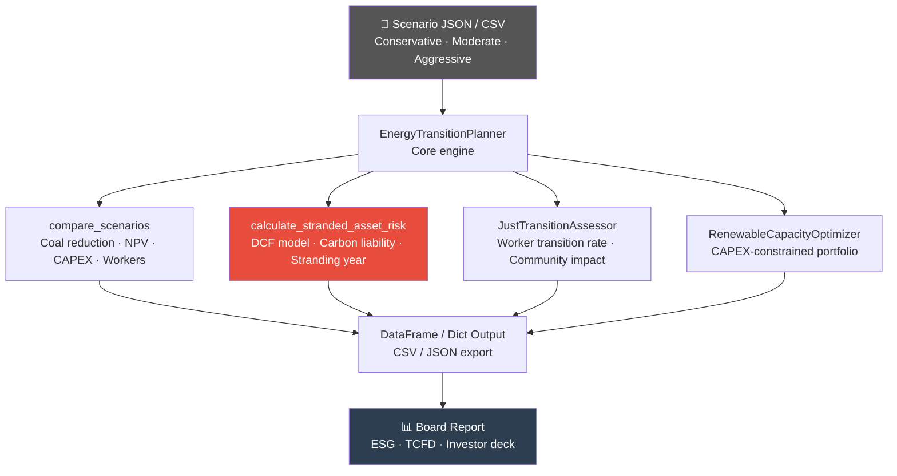

# ⚡ Energy Transition Planner


Coal-to-renewable energy transition scenario planning and financial modelling toolkit. Covers scenario comparison (Conservative / Moderate / Aggressive), stranded asset risk assessment, just transition worker impact, and renewable capacity optimisation — built for ESG analysts and energy strategy teams at coal companies.

---

## 🎯 Features

- **Scenario Comparison** — Side-by-side Bear/Base/Bull transition pathways with coal reduction %, NPV, CAPEX, and worker impact
- **Stranded Asset Risk** — Discounted cash-flow model estimating asset stranding year, carbon liability NPV, and risk score (0–100)
- **Just Transition Assessment** — Worker transition rate modelling across scenarios
- **Renewable Capacity Optimizer** — CAPEX-constrained renewable portfolio allocation
- **Carbon Liability Calculator** — NPV of escalating carbon costs under Paris-aligned price paths
- **Stranding Year Projection** — Year in which coal demand erosion pushes asset below 30% of book value
- Supports JSON and CSV scenario inputs

---

## 📦 Quick Start

**Step 1: Clone**
```bash
git clone https://github.com/achmadnaufal/energy-transition-planner.git
cd energy-transition-planner
```

**Step 2: Install**
```bash
pip install -r requirements.txt
```

**Step 3: Run demo**
```bash
python3 demo/run_demo.py
```

---

## 💡 Usage

### Scenario Comparison

```python
from src.main import EnergyTransitionPlanner
import json

planner = EnergyTransitionPlanner()

with open("sample_data/transition_scenarios.json") as f:
    data = json.load(f)
scenarios = {s["scenario_id"]: s for s in data["scenarios"]}

comparison = planner.compare_scenarios(scenarios)
print(comparison[["scenario_name", "coal_capacity_reduction_pct", "npv_billion_usd", "npv_capex_ratio"]])
```

### Stranded Asset Risk

```python
risk = planner.calculate_stranded_asset_risk(
    asset_book_value_usd=500_000_000,
    remaining_life_years=20,
    coal_demand_decline_pct_annual=4.0,
    carbon_price_usd_per_tco2=50.0,
    annual_emissions_tco2=800_000,
)

print(f"Risk score        : {risk['risk_score']:.1f}/100")
print(f"Transition urgency: {risk['transition_urgency']}")
print(f"Carbon liability  : ${risk['carbon_liability_npv_usd']:,.0f}")
```

## Data Format

Scenario JSON structure:
```json
{
  "scenario_id": "moderate",
  "scenario_name": "Moderate Transition",
  "coal_capacity_2026_mw": 5000,
  "coal_capacity_2035_mw": 2000,
  "renewables_capacity_2026_mw": 500,
  "renewables_capacity_2035_mw": 3500,
  "capex_billion_usd": 4.0,
  "workers_transitioned": 3500,
  "timeline_years": 10,
  "npv_billion_usd": 2.1
}
```

---

## 📊 Example Output

```
$ python3 demo/run_demo.py
==================================================================
  Energy Transition Planner — Demo
  Coal-to-Renewable Scenario Modelling & Stranded Asset Risk
==================================================================

✓ Loaded 3 transition scenarios from transition_scenarios.json

✓ Energy Transition Scenario Comparison:
  Scenario                Coal Reduction  Renewables +MW  CAPEX $B  NPV $B  NPV/CAPEX  Workers
  --------------------------------------------------------------------------------------------
  Conservative Transition          40.0%          2,000       2.5     1.2      0.48x    2,000
  Moderate Transition              60.0%          3,000       4.0     2.1      0.53x    3,500
  Aggressive Transition            90.0%          4,000       6.5     3.5      0.54x    4,500

  Best NPV/CAPEX ratio  : Aggressive (0.54x)
  Most workers impacted : Aggressive (4,500 transitioned)

✓ Stranded Asset Risk Assessment ($500M coal plant, 20-year life):
  Scenario         Decline %/yr  Carbon $/t  Risk Score  Urgency   Carbon NPV Liability
  --------------------------------------------------------------------------------------
  Conservative              2.0%       30.0        37.5   moderate    $   226,138,360
  Moderate                  4.0%       50.0        62.5   high        $   603,035,627
  Aggressive                6.0%       80.0        90.0   critical    $ 1,447,285,505

✓ Just Transition Assessment — Worker Impact:
  Conservative : 2,000 workers (13.3% transition rate over 10 yr)
  Moderate     : 3,500 workers (23.3% transition rate over 10 yr)
  Aggressive   : 4,500 workers (30.0% transition rate over 10 yr)

  Recommendation: Moderate scenario delivers best balance —
    60% coal reduction, 3,000 MW renewables added, NPV/CAPEX 0.53x

==================================================================
  ✅ Demo complete
==================================================================
```

---

## 🗺️ Architecture



---

## 📁 Project Structure

```
energy-transition-planner/
├── src/
│   ├── main.py                         # EnergyTransitionPlanner — core
│   ├── stranded_asset_calculator.py    # DCF stranded asset model
│   ├── renewable_capacity_optimizer.py # CAPEX portfolio optimizer
│   ├── just_transition_assessor.py     # Worker transition modelling
│   └── data_generator.py               # Sample data generator
├── sample_data/
│   └── transition_scenarios.json       # 3 scenarios (Conservative/Moderate/Aggressive)
├── demo/
│   └── run_demo.py                     # End-to-end demo
├── tests/
├── requirements.txt
└── README.md
```

---

## 🧮 Key Calculations

```
Stranded Asset Model:
  Cumulative value declines at coal_demand_decline % annually
  Stranding triggered when value < 30% of book value
  Carbon liability = Σ (annual_emissions × escalating_carbon_price) / (1.08^year)

Risk Score (0–100):
  Demand risk = min(60, decline_rate × 10)
  Carbon risk = min(25, carbon_price / 100 × 25)
  Life risk   = min(15, remaining_years / 30 × 15)
```

---

## 🛠️ Tech Stack

| Tool | Purpose |
|---|---|
| **Python 3.9+** | Core language |
| **pandas / numpy** | Scenario data processing |
| **matplotlib** | Scenario visualisation |
| **scipy** | Financial modelling |
| **pytest** | Unit testing |

---

## 🧪 Testing

```bash
pytest tests/ -v
```

---

## 📄 License

MIT License — free to use, modify, and distribute.

---

> Built by [Achmad Naufal](https://github.com/achmadnaufal) | Lead Data Analyst | Power BI · SQL · Python · GIS
